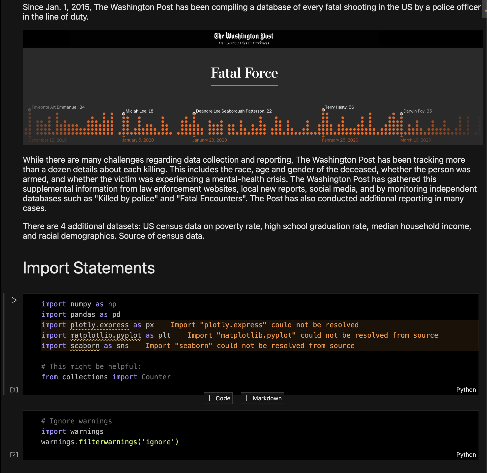

# 🚔 Analyse Deaths Involving Police in the US 🇺🇸

A data analysis project focused on uncovering patterns and trends related to police-involved deaths in the United States. This project uses publicly available datasets and advanced data analysis techniques to provide insights into demographic, temporal, and geographic factors associated with these incidents.

---

## 📸 Screenshots

---

## ✨ Features

- Data Wrangling: Processed and cleaned the dataset for accurate analysis.
- Demographic Analysis: Studied the impact of incidents across different racial, gender, and age groups.
- Geographical Insights: Identified states and cities with the highest incidents through mapping and visualizations.
- Temporal Analysis: Analyzed incidents over time (yearly, monthly, and daily patterns).
- Interactive Visualizations: Created dynamic charts and maps for better understanding and communication of insights.
- Correlation Analysis: Explored relationships between key variables to identify significant trends.

---

## ⚙️ Tech Stack

- Pandas, NumPy: For data cleaning, manipulation, and analysis.
- Matplotlib, Seaborn: For creating static visualizations like bar charts, line graphs, and heatmaps.
- Plotly: For interactive and geospatial visualizations.
- Counter (collections): For efficient counting and aggregation of categorical data.
